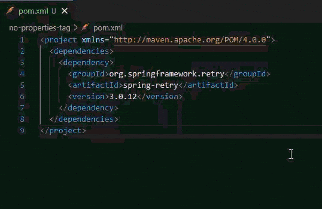
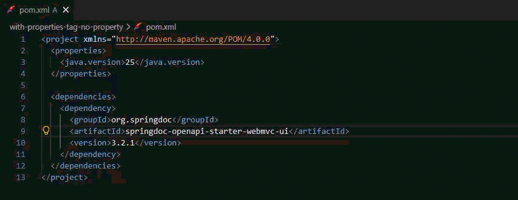

# POM tools

Toolbox for Maven configuration file `pom.xml`

## ✨ Features

- Extract dependency version to properties tag `<properties>...</properties>` in `pom.xml` file.
- Use the lightbulb 💡, or `Ctrl + .` when you are inside a dependency tag `<dependency>...</dependency>`.

### 🔎 Extract version to properties tag
#### No properties tag

 
#### Properties tag exists, no equal property name

## 📋 Requirements

There are currently no requirements.

## ⚙️ Extension Settings

There are currently no extension settings available.

## 🐞 Known Issues

None have been recorded so far.

## 📢 Release Notes

Users appreciate release notes as you update your extension.

### 0.0.1

Initial release.
